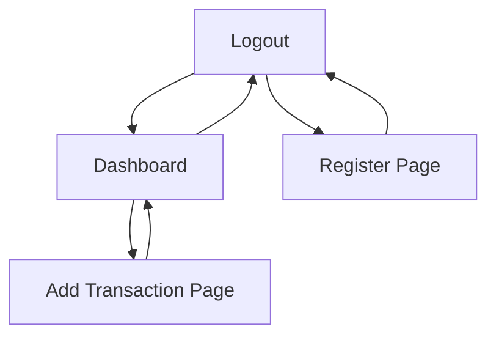

## 1. Product Overview
A personal expense tracker application that helps users manage their finances by tracking income and expenses, viewing transaction history, and monitoring their financial balance through an intuitive dashboard interface.

The product solves the problem of manual expense tracking by providing a digital solution that automatically calculates balances and categorizes transactions, helping users make better financial decisions through clear visualization of their spending patterns.

## 2. Core Features

### 2.1 User Roles
| Role | Registration Method | Core Permissions |
|------|---------------------|------------------|
| User | Email registration with password | Full access to personal expense data, transaction management, and dashboard analytics |

### 2.2 Feature Module
The expense tracker consists of the following main pages:
1. **Login page**: User authentication, password input, navigation to registration.
2. **Register page**: New user account creation with email and password.
3. **Dashboard page**: Financial overview showing income/expense totals, current balance, and recent transaction list.
4. **Add Transaction page**: Form to create new income or expense entries with amount, category, and description.

### 2.3 Page Details
| Page Name | Module Name | Feature description |
|-----------|-------------|---------------------|
| Login page | Authentication form | Allow users to enter email and password to access their account with validation and error handling. |
| Login page | Navigation link | Provide link to register page for new users. |
| Register page | Registration form | Enable new users to create account with email, password, and password confirmation fields. |
| Register page | Form validation | Validate email format, password strength, and matching confirmation before submission. |
| Dashboard page | Balance overview | Display current total balance calculated from all transactions with clear visual presentation. |
| Dashboard page | Income/Expense summary | Show total income and total expenses with visual indicators or cards. |
| Dashboard page | Recent transactions | List most recent 5-10 transactions showing amount, category, description, and date. |
| Dashboard page | Navigation | Provide access to add new transaction and logout functionality. |
| Add Transaction page | Transaction form | Allow users to input transaction amount, select income/expense type, choose category, and add description. |
| Add Transaction page | Category selection | Provide predefined categories for both income and expense types. |
| Add Transaction page | Form submission | Validate all fields and save transaction to user's account. |
| Add Transaction page | Navigation | Include cancel option to return to dashboard without saving. |

## 3. Core Process
**User Registration Flow**: User navigates to register page → fills registration form → system validates input → creates new account → redirects to login page → user logs in → accesses dashboard.

**Transaction Management Flow**: User logs in → views dashboard → clicks add transaction → fills transaction form → submits → system validates and saves → redirects to updated dashboard → user sees new transaction in recent list and updated balance.

## 4. User Interface Design

### 4.1 Design Style
- **Primary colors**: Professional blue (#2563eb) for primary actions, green (#10b981) for income, red (#ef4444) for expenses
- **Button style**: Rounded corners with clear hover states and loading indicators
- **Font**: Clean, modern sans-serif (Inter or similar) with clear hierarchy
- **Layout style**: Card-based design with consistent spacing and mobile-responsive grid
- **Icons**: Minimalist line icons for categories and actions

### 4.2 Page Design Overview
| Page Name | Module Name | UI Elements |
|-----------|-------------|-------------|
| Login page | Authentication form | Centered card layout with email/password inputs, submit button, and register link below form. |
| Register page | Registration form | Similar centered card with email, password, confirm password fields, and login link for existing users. |
| Dashboard page | Balance overview | Large prominent card showing current balance with currency symbol and clear typography. |
| Dashboard page | Income/Expense summary | Two side-by-side cards with green/red color coding and large numbers for visual clarity. |
| Dashboard page | Recent transactions | Scrollable list with alternating row colors, showing amount with +/- indicators and transaction details. |
| Add Transaction page | Transaction form | Clean form with amount input (numeric), type selector (toggle), category dropdown, and description textarea. |

### 4.3 Responsiveness
Desktop-first design approach with mobile-responsive layouts that adapt to tablet and phone screen sizes. Touch-optimized interactions for mobile devices with appropriately sized touch targets.

### 4.4 Data Visualization
Clear visual hierarchy with color-coded financial data (green for income, red for expenses), prominent balance display, and intuitive transaction list with visual indicators for transaction types.